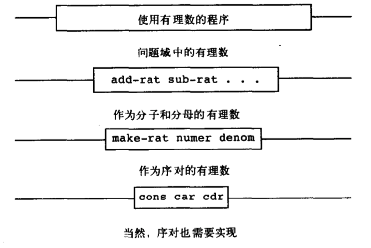

# 2.1.1 有理数的算术运算

假设我们已经有了从分子，分母构造有理数的方法，从有理数取得分子，分母的方法。

1. (make-rat <n\> \<d\>) 返回一个有理数，分子为 n, 分母为 d
2. (numer \<x\>) 返回有理数 x 的分子
3. (denom \<x>) 返回有理数 x 的分母

则可以根据公式定义操作有理数的方法
$$
\frac{n_1}{d_1} + \frac{n_2}{d_2} = \frac{n_1d_2 + n_2d_1}{d_1d_2} \\
\frac{n_1}{d_1} - \frac{n_2}{d_2} = \frac{n_1d_2 - n_2d_1}{d_1d_2} \\
\frac{n_1}{d_1} \cdot \frac{n_2}{d_2} = \frac{n_1 \cdot n_2}{d_1 \cdot n_2} \\
\frac{\frac{n_1}{d_1}}{\frac{n_2}{d_2}} = \frac{n_1 \cdot d_2}{d_1 \cdot n_2} \\
\frac{n_1}{d_1} = \frac{n_2}{d_2} \text{当且仅当} n_1d_2=n_2d_1
$$

```scheme
(define (add-rat x y)
	(make-rat (+ (* (numer x)
                  (denom y))
               (* (denom x)
                  (numer y)))
            (* (denom y) (denom x)))  
)

(define (sub-rat x y)
	(make-rat (- (* (numer x)
                  (denom y))
               (* (denom x)
                  (numer y)))
            (* (denom y) (denom x)))  
)

(define (mul-rat x y)
  (make-rat (* (numer x) (numer y))
            (* (denom x) (denom y)))
)

(define (div-rat x y)
  (make-rat (* (numer x) (denom y))
            (* (numer y) (denom x)))
)

(define (equal-rat? x y)
  (= (* (numer x) (denom y))
     (* (numer y) (denom x)))
)
```

### 序对

**cons 将两个参数复合, car 取出第一参数, cdr取出第二个参数**

### 有理数表示

```scheme
(define (make-rat n d) (cons n d))
(define (numer x) (car x))
(define (denom x) (cdr x))
```

## 2.1 练习

```scheme
(define (make-rat n d)
  (cond ((and (positive? n) (positive? d))
         (let ((g (gcd n d)))
           (cons (/ n g) (/ d g))))
        ((positive? n)
         (let ((g (gcd n (- d))))
           (cons (- (/ n g))
                 (/ (- d) g))))
        (else
          (let ((g (gcd (- n) d)))
            (cons (- (/ (- n) g))
                  (/ d g)))))
)


(print-rat (make-rat (- 10) 12)) ; -5/6
(print-rat (make-rat 10 (- 12))) ; -5/6
```

# 2.1.2 抽象屏障

> 一般而言，数据抽象的基本思想就是为每一类数据对象标识出一组操作，使得对这类数据的操作都可以基于它们表述，而且在操作这类数据时只使用它们。



这种屏障将使用抽象数据的程序与实现抽象数据的程序分开。

优点：使程序很容易维护和修改。

在实现有理数约分化简时，可以采用不同的方式，而这种改变并不会影响到上层次的程序。

```scheme
(define (make-rat n d)
  (cons n d)
)

(define (numer x)
  (let ((g (gcd (car x) (cdr x))))
    (/ (car x) g))
)

(define (denom x)
  (let ((g (gcd (car x) (cdr x))))
    (/ (cdr x) g))
)
```

## 练习2.2

```scheme
(define (make-point x y) (cons x y))

(define (x-point p) (car p))

(define (y-point p) (cdr p))

(define (make-segment p1 p2) (cons p1 p2))

(define (start-segment s) (car s))

(define (end-segment s) (cdr s))

(define (midpoint-segment segment)
  (make-point (/ (+ (x-point (start-segment segment))
                    (x-point (end-segment segment)))
                  2)
              (/ (+ (y-point (start-segment segment))
                    (y-point (end-segment segment)))
                  2))
)

(define (print-point p)
  (newline)
  (display "(")
  (display (x-point p))
  (display ",")
  (display (y-point p))
  (display ")")
)

(define x1 (make-point 1 2))
(define x2 (make-point 3 6))

(print-point (midpoint-segment (make-segment x1 x2)))
```

## 练习2.3

```scheme
;; 在此题中矩形的选择函数为中层，周长和面积公式为上层程序使用矩形公共的选择函数
;; 矩形的构成则为底层数据抽象
;; 此题选择矩形的选择函数为返回一个线段，也可以实现为返回长度和宽度

;; 第一种实现方法，接受高宽两个线段
(define (rectangle height width)
  (cons height width)
)

; 第二种实现方法，接受一个点，宽 高
(define (rectangle p width height)
  (cons (make-segment p (make-point (+ (x-point p) width)
                                    (y-point p)))
        (make-segment p (make-point (x-point p)
                                    (+ (y-point p) height))))
)


(define (h-rect rect) (car rect))
(define (w-rect rect) (cdr rect))

;; 计算线段长度
(define (segment-length segment)
  (sqrt (+ (square (- (x-point (end-segment segment))
                      (x-point (start-segment segment))))
           (square (- (y-point (end-segment segment))
                      (y-point (start-segment segment))))))
)

(define (area-rectangle rect)
  (* (segment-length (h-rect rect))
     (segment-length (w-rect rect)))
)

(define (perimeter-rectangle rect)
  (* (+ (segment-length (h-rect rect))
        (segment-length (w-rect rect))) 2)
)
```

# 2.1.3 数据意味着什么

在 2.11 中我们实现了有理数的构造函数和选择函数。但不是任意三个过程都能实现出有理数，它需要满足一定的条件。

假设 x 是通过 (make-rat n d)构造的有理数，则
$$
\frac{(numer \ \ x)}{(denom \ \ x)} = \frac{n}{d}
$$

>  一般而言，我们总可以将数据定义为一组适当构造函数和选择函数，以及为使这些过程称为一套合法表示，它们就必须满足特定的条件。

对于**序对**，它们需要满足的条件是，若 z 为 (cons x y)，则 (car z) 为 x, (cdr z) 为 y.

```scheme
(define (cons a b)
	(define (dispatch i)
  	(cond ((= i 0) a)
          ((= i 1) b)
          (else
            (error "Argument not 0 or 1 -- CONS" i)))
  )
  dispatch
)

(define (car z) (z 0))
(define (cdr z) (z 1))
```

## 练习 2.4 2.5 2.6

```scheme
;; 2.4
(define (cons x y)
  (lambda (m) (m x y))
)

(define (car z)
  (z (lambda (x y) x))
)

(define (cdr z)
  (z (lambda (x y) y))
)

;;2.5
(define (cons a b)
  (* (expt 2 a)
     (expt 3 b))
)

(define (car z)
  (if (= (gcd z 2) 1)
      0
      (+ 1 (car (/ z 2))))
)

(define (cdr z)
  (if (= (gcd z 3) 1)
      0
      (+ 1 (cdr (/ z 3))))
)

;; 2.6 church
(define zero (lambda (f) (lambda (x) x)))

(define (add-one n)
  (lambda (f)
          (lambda (x)
                  (f ((n f) x))
          )
  )
)

(define one (lambda (f) (lambda (x) (f x))))

;; (f ((one f) x)) = (f (f x))
(define two (lambda (f) (lambda (x) (f (f x)))))

(define three (lambda (f) (lambda (x) (f (f (f x))))))


(define plus (n1 n2)
  (lambda (f)
          (lambda (x)
                  ((n2 f) ((n1 f) x))
                  ))
)
```

# 区间算术

简单记录

区间运算的本质
$$
[a, b] \oplus [c, d] = [c, f] \\
x_1 \in [a, b] \\
x_2 \in [c, d] \\
x_1 \oplus x_2 \in [c, f]
$$

$$
对于函数 f(x) = x^2 \in [0,1] \hspace{1cm}
x \in [-1,1] \\
对于函数 f(x, y) = x * y \in [-1,1] \hspace{1cm} x \in [-1,1], y \in [-1,1]
$$

