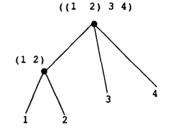
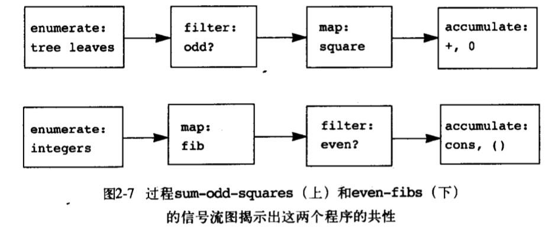

> 闭包性质的第一种含义：
> 一般说，某种组合数据对象的操作满足闭包性质，那就是说，通过它组合起数据对象得到的结果本身还可以通过同样的操作在进行组合。

cons 就满足闭包性质，cons 的元素本身还可以是 cons 组合的结果。

# 2.2.1 序列的表示

```scheme
(list <a1> <a2> ...)
等价于
(cons <a1> (cons <a2> (cons ...)))
```

## 表操作

```scheme
;; 获取指定索引的数
(define (list-ref items n)
  (if (= n 0)
      (car items)
      (list-ref (cdr items) (- n 1)))
)
```

null? 检测是否为空表

```scheme
(define (length itmes)
  (if (null? items)
      0
      (+ (length (cdr items)) 1))
)
```

Append 方法的实现，链接两个表

```scheme
(define (append list1 list2)
	(if (null? list1)
      list2
      (cons (car list1) (append (cdr list1) list2)))  
)
```

## 练习 2.17-2.20

```scheme
;2.17
(define (last-pair items)
  (let ((cur (car items))
        (next (cdr items)))
    (if (null? next)
        cur
        (last-pair next)))
)
;2.18
(define (reverse items)
  (let ((cur (car items)
        (next (cdr items))))
    (if (null? next)
        cur
        (cons (reverse next) cur)))
)
;2.19
(define us-coins (list 50 25 10 5 1))
(define uk-coins (list 100 50 20 10 5 2 1 0.5))

(define (coins-exchange amount coins-list)
  (cond ((= amount 0) 1)
        ((< amount 0) 0)
        ((null? coins-list) 0)
        (else
          (let ((cur-coins (car coins-list))
                (next (cdr coins-list)))
            (+ (coins-exchange (- amount cur-coins) coins-list)
               (coins-exchange amount next)))))
)
;2.20
(define nil '())

(define (same-parity first . next)
  (define (filter f list predicate)
    (cond ((null? list) nil)
          ((= (remainder (car list) 2) f)
           (cons (car list) (filter f (cdr list) predicate)))
          (else
            (filter f (cdr list) predicate)))
  )
  (cons first (filter first next (remainder first 2)))
)

(define (same-parity first . rest)
  (define (same-parity-iter source dist val)
    (if (null? source)
        dist
        (same-parity-iter (cdr source)
                          (if (= (remainder (car source) 2) val)
                              (append dist (list (car source)))
                              dist)
                          val))
  )
  (same-parity-iter rest (list first) (remainder first 2))
)
```

## 表的映射

```scheme
(define (scale-list items factor)
  (if (null? items)
      nil
      (cons (* (car items) factor)
            (scale-list (cdr items) factor)))
)

(scale-list (list 1 2 3) 2)

(define (map proc items)
  (if (null? items)
      nil
      (cons (proc (car items))
            (map proc (cdr items))))
)
```

# 2.2.2层次性结构

我们可以将（cons （list 1 2）（list 3 4））看成另外一种结构，树



## 练习2.32

```scheme
;子集
(define (subsets s)
  (if (null? s)
      (list '())
      (let ((rest (subsets (cdr s))))
        (append rest (map (lambda (sub) (append (list (car s)) sub))  rest))))
)

(subsets (list 1 2 3))
;Value: (() (3) (2) (2 3) (1) (1 3) (1 2) (1 2 3))
```

# 2.2.3 序列作为一种约定的界面

```scheme
(define (sum-odd-square tree)
  (cond ((null? tree) 0)
        ((not (pair? tree))
         (if (odd? tree) (square tree) 0))
        (else
          (+ (sum-odd-square (car tree))
             (sum-off-square (cdr tree)))))
)

(define (even-fibs n)
  (define (next k)
    (if (> k n)
        '()
        (let ((f (fib k)))
          (if (even? f)
              (cons f (next (+ k 1)))
              (next (+ k 1)))))
  )
  (next 0)
)
```



定义相关操作

```scheme
;; 序列操作 信号流操作
;; 映射
(define (map proc items)
  (if (null? items)
      nil
      (cons (proc (car items))
            (map proc (cdr items))))
)

; 过滤
(define (filter predicate sequence)
  (cond ((null? sequence) nil)
        ((predicate (car sequence))
         (cons (car sequence)
               (filter predicate (cdr sequence))))
        (else
         (filter predicate (cdr sequence))))
)

; 积累
(define (accmulate op initial sequence)
  (if (null? sequence)
      initial
      (op (car sequence)
          (accmulate op initial (cdr sequence))))
)

;; 枚举区间
(define (enumerate-interval low high)
  (if (> low high)
      nil
      (cons low (enumerate-interval (+ low 1) high)))
)

; 枚举树的叶子节点
(define (enumerate-trees tree)
  (cond ((null? tree) nil)
        ((not (pair? tree)) (list tree))
        (else (append (enumerate-trees (car tree))
                      (enumerate-trees (cdr tree)))))
)
```

在这里，用表实现的序列作为一种方便的界面，我们可以利用这种界面去组合各种处理模块，进一步说，如果以序列作为所用的统一表示结构，我们就能将程序对于数据结构的依赖局限于不多的序列操作上去。

## 嵌套映射

```scheme

;; 将序列元素映射序列
(define (flatmap proc seq)
  (accmulate append nil (map proc seq)))


(define (prime-sum? pair)
  (prime? (+ (car pair) (cadr pair))))

(define (make-pair-sum pair)
  (list (car pair) (cadr pair) (+ (car pair) (cadr pair))))

(define (prime-sum-pair n)
  (map make-pair-sum
       (filter prime-sum?
	       (flatmap
          (lambda (i)
            (map (lambda (j) (list i j))
                (enumerate-interval 1 (- i 1))))
          (enumerate-interval 1 n)))))
(prime-sum-pair 10)

```

