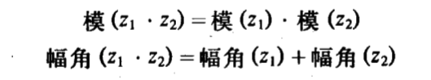

数据抽象是将数据的表示和使用隔离，提供数据构造函数，选择函数，谓词等供上层程序使用，上层程序不需要知道数据的实现。在需要改变数据时，只需重写数据的内部实现，上层程序不需改变。但是这种类型的数据抽象还不够强大。

一个程序可能用到同一种数据的不同实现，例如对复数有直角坐标系和极坐标系两种不同形式，并且都有各自的优势，而系统过程可能具有对任意表示形式的复数进行工作的能力。

通用型过程就是可以操作数据不同表示形式的过程。实现通用型过程采用的主要技术是让它们在带有类型标志的数据对象上工作。

数据导向的程序设计就是用于构造采用通用型数据的系统。


# 2.4.1复数的表示


当操作两个复数相加时，使用直角坐标系。当操作两个复数相乘时，使用极坐标系。




```scheme
; 直角坐标系出发
(define (real-part z) (car z))
(define (imag-part z) (cdr z))

;; 利用三角函数公式得到极坐标系
(define (magnitude z)
  (sqrt (+ (square (real-part z)) (square (imag-part z)))))
(define (angle x) (atan (imag-part z) (real-part z)))

(define (make-from-real-imag x y) (cons x y))
(define (make-from-mag-ang r a) (cons (* r (cos a))
                                      (* r (sin a))))

;; 从极坐标系出发
(define (magnitude z) (car z))
(define (angle z) (cdr z))

(define (real-part z) (* (magnitude z) (cos (angle z))))
(define (imag-part z) (* (magnitude z) (sin (angle z))))

(define (make-from-real-imag x y)
  (cons (sqrt (+ (square x) (square y)))
        (atan y x)))

(define (make-from-mag-ang r a) (cons r a))

; 创建通用型过程
(define (add-complex z1 z2)
  (make-from-real-imag (+ (real-part z1) (real-part z2))
                       (+ (imag-part z1) (imag-part z2))))

(define (sub-complex z1 z2)
  (make-from-real-imag (- (real-part z1) (real-part z2))
                       (- (imag-part z1) (imag-part z2))))

(define (mul-complex z1 z2)
  (make-from-mag-ang (* (magnitude z1) (magnitude z2))
                     (+ (angle z1) (angle z2))))

(define (div-complex z1 z2)
  (make-from-mag-ang (/ (magnitude z1) (magnitude z2))
                     (- (angle z1) (angle z2))))
```

# 2.4.2带标志的类型

```scheme
(define (attach-tag type-tag contents)
  (cons type-tag contents))

(define (tag-name datum)
  (if (pair? datum)
      (car datum)
      (error "Bad tagged datum -- Type-Tag" datum)))

(define (contents datum)
  (if (pair? datum)
      (cdr datum)
      (error "Bad tagged datum -- Contents" datum)))

;; 定义谓词 rectangular? polar?

(define (rectangular? z)
  (eq? (type-tag z) 'rectangular ))

(define (polar? z)
  (eq? (type-tag z) 'polar ))

; 定义带 rectangular 符号的直角坐标系复数形式
(define (real-part-rectangular z) (car z))
(define (imag-part-rectangular z) (cdr z))

;; 半径
(define (magnitude-rectangular z)
  (sqrt (+ (square (real-part-rectangular z))
           (square (imag-part-rectangular z)))))
;; 角度
(define (angle-rectangular z)
  (atan (imag-part-rectangular z)
        (real-part-rectangular z)))

(define (make-from-real-imag-rectangular x y)
  (attach-tag 'rectangular (cons x y)))

(define (make-from-mag-ang-rectangular r a)
  (attach-tag 'rectangular (cons (* r (cos a)) (* r (sin a)))))

; 定义带 polar 符号的极坐标系复数形式
(define (real-part-polar z)
  (* (magnitude-polar z) (cos (angle-polar z))))

(define (imag-part-polar z)
  (* (magnitude-polar z) (sin (angle-polar z))))

(define (magnitude-polar z) (car z))
(define (angle-polar z) (cdr z))

(define (make-from-real-imag-polar x y)
  (attach-tag 'polar (cons (sqrt (+ (square x) (square y)))
                           (atan y x))))

(define (make-from-mag-ang-polar m a) (attach-tag 'polar (cons m a)))


;; 通用型的选择函数 
(define (real-part z)
  (cond ((rectangular? z)
         (real-part-rectangular (contents z)))
        ((polar? z)
         (real-part-polar (contents z)))
        (else
         (error "Unknown type -- REAL-PART" z))))

(define (iamg-part z)
  (cond ((rectangular? z) (imag-part-rectangular (contents z)))
        ((polar? z) (imag-part-polar (contents z)))
        (else (error "Unknown type -- IMAG-PART" z))))

(define (magnitude z)
  (cond ((rectangular? z) (magnitude-rectangular (contents z)))
        ((polar? z) (magnitude-polar (contents z)))
        (else (error "Unknown type -- MAGNITUDE" z))))

(define (angle z)
  (cond ((rectangular? z) (angle-rectangular (contents z)))
        ((polar? z) (angle-polar (contents z)))
        (else
          (error "Unknown type -- ANGLE" z))))

(define (add-complex z1 z2) (make-from-real-imag (+ (real-part z1) (real-part z2))
                                                 (+ (imag-part z1) (imag-part z2))))

(define (make-from-real-imag x y)
  (make-from-real-imag-rectangular x y))

(define (make-from-mag-ang r a)
  (make-from-mag-ang-polar r a))
```

# 2.4.3数据导向的程序设计和可加性

> 基于类型的分派：检查一个数据项的类型并据此调用相应的过程。
>
> 存在的弱点：
>
> 1. 当新增一种数据类型时，位于上层的通用型过程就必须增加新的检查子句，来检查新类型并调用新的选择函数。
> 2. 程序必须保持不重名
>
> 基础问题：上述实现通用型界面的技术不具有<span style="color:red;">可加性</span>

<span style="font-size: 34px;">数据导向的程序设计</span>


数据导向的程序设计就是一种使程序能直接利用这种表格工作的程序设计技术。我们需要将表格界面实现一个过程，这个过程接受操作名和参数类型两个参数，并在表中寻找到相应的操作过程。

*(put \<op>  \<type>  \<item>)*

*(get \<op>  \<type>)*


## 消息传递

