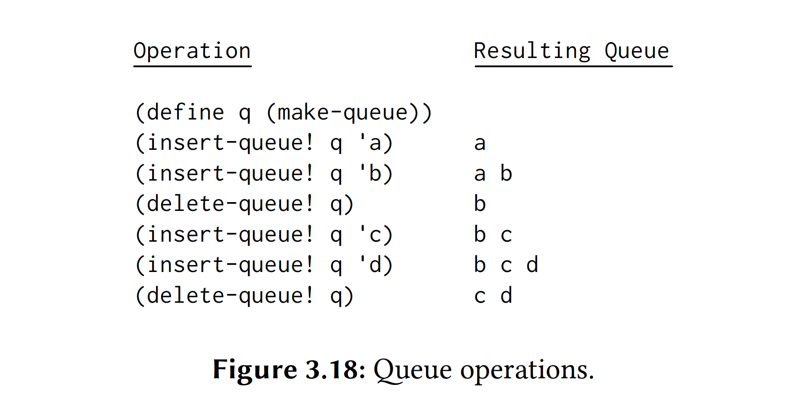
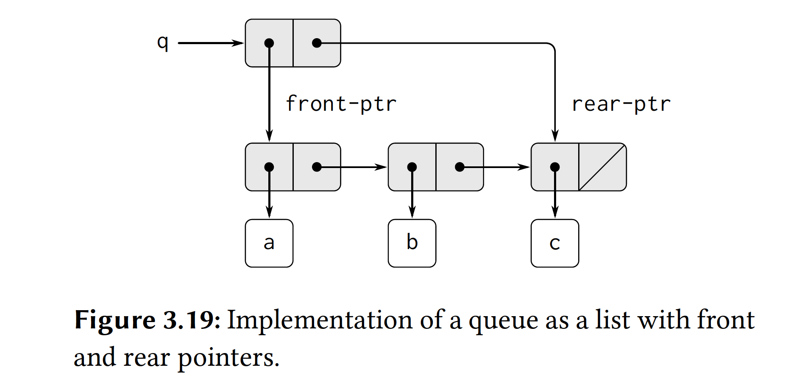
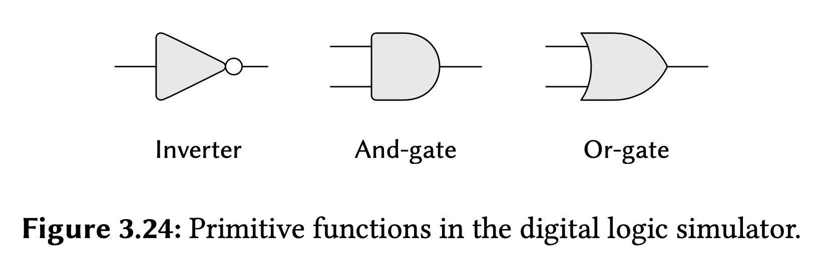
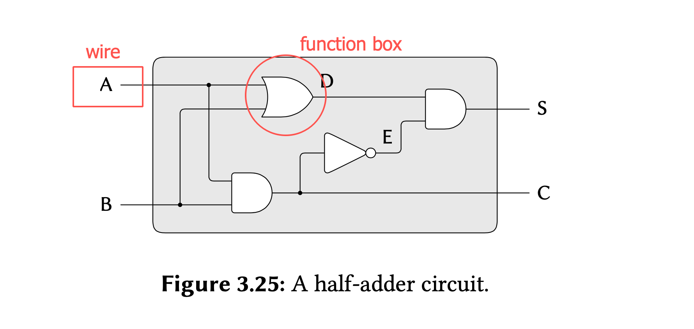
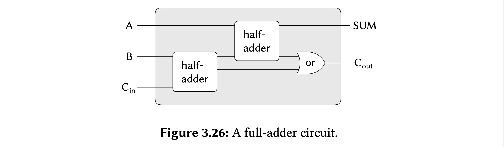
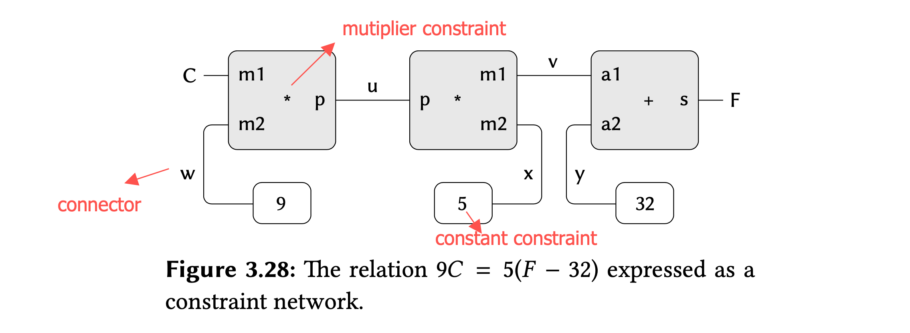

# 3.3.2 representing queue



We will add an additional pointer that indicates the final pair of lists when we implement the queue. That way, when we insert an item, we consult the rear pointer and avoid scanning the list.



```scheme
(define (front-ptr q) (car q))
(define (rear-ptr q) (cdr q))
(define (set-front-ptr! q item)
  (set-car! q item))
(define (set-rear-ptr! q item)
  (set-cdr! q item))

(define (empty-queue? q)
  (null? (front-ptr q)))

(define (make-queue) (cons '() '()))

(define (front-queue q)
  (if (empty-queue? q)
      (error "FRONT calls with empty queue" q)
      (car (front-ptr q))))

(define (insert-queue q item)
  (let ((new-pair (cons item '())))
    (if (empty-queue? q)
        (begin (set-front-ptr! queue new-pair)
               (set-rear-ptr! queue new-pair)
               queue)
        (begin (set-cdr! (rear-ptr queue) new-pair)
               (set-rear-ptr! queue new-pair)
               queue))))

(define (delete-queue q)
  (if (empty-queue? q)
      (error "DELETE-QUEUE calls with empty queue" queue)
      (begin (set-front-ptr! q (cdr (front-ptr q)))
             queue)))
```

# 3.3.3 Representing tables


```scheme
;; one-dimensional tables
(define (lookup key table)
  (let ((record (assoc key (cdr tabel))))
    (if record
        (cdr record)
        false)))

(define (assoc key records)
  (cond ((null? records) false)
        ((equal? (caar records) key) (car records))
        (else
         (assoc key (cdr records)))))


(define (insert! key value table)
  (let ((record (assoc key (cdr table))))
    (if record
        (set-cdr! record value)
        (set-cdr! table
                  (cons (cons key value)
                        (cdr table))))
    'ok))

(define (make-table) (list '*table*))

;; two-dimensional tables

(define (lookup2d! key1 key2 table)
  (let ((subtable (assoc key1 (cdr table))))
    (if subtable
        (let ((record (assoc key2 (cdr subtable))))
          (if record
              (cdr record)
              false))
        false)))

(define (insert2d! key1 key2 value table)
  (let ((subtable (assoc key1 (cdr table))))
    (if subtable
        (insert! key2 value subtable)
        (set-cdr! table
                  (cons (list key1 (cons key2 value))
                        (cdr table))))
    'ok))

;; creating local state

(define (make-table-local)
  (let ((local-table (list '*local-table*)))
    (define (lookup key1 key2)
      (let ((subtable (assoc key1 (cdr local-table))))
        (if subtable
            (let ((record (assoc key2 (cdr subtable))))
              (if record
                  (cdr record)
                  #f))
            #f)))

    (define (insert key1 key2 value)
      (let ((subtable (assoc key1 (cdr local-table))))
        (if subtable
            (insert! key2 value subtable)
            (set-cdr! local-table
                      (cons (list key1 (cons key2 value))
                            (cdr local-table))))
        'ok))
    (define (dispatch op)
      (cond ((eq? op 'lookup) lookup)
            ((eq? op 'insert) insert)
            (else
             (error "Unknown operation: TABLE" op))))
    dispatch))

(define generation-table (make-table-local))
(define put (generation-table 'insert))
(define get (generation-table 'lookup))

(put 'make 'number 1)

(get 'make 'number)

;;(put 'make 'number 1)

;;(get 'make 'number)
```

## 习题3.25

```scheme
(define (assoc key records)
  (cond ((null? records) false)
        ((equal? (caar records) key) (car records))
        (else
         (assoc key (cdr records)))))

(define (make-general-table)
  (let ((table (list '*general-table*)))
    ;
    (define (lookup-general table keys)
      (cond ((null? keys) (error "LOOKUP don't have keys"))
            ((= (length keys) 1)
             (let ((record (assoc (car keys) (cdr table))))
               (if record
                   (cdr record)
                   false)))
            (else
             (let ((subtable (assoc (car keys) (cdr table))))
               (if subtable
                   (lookup-general subtable (cdr keys))
                   #f)))))
    (define (insert-general table value keys)
      (cond ((= (length keys) 0)
             (error "INSER don't calls with keys"))
            ((= (length keys) 1)
             (let ((record (assoc (car keys) (cdr table))))
               (if record
                   (set-cdr! record value)
                   (set-cdr! table
                             (cons (cons (car keys) value)
                                   (cdr table))))
               table))
            (else
             ;; need verify that subtable is exist
             (let ((subtable (assoc (car keys) (cdr table))))
               (if subtable
                   ;; subtable exist -> recursive
                   (insert-general subtable value (cdr keys))
                   ;; subtable don't exist -> create table -> recursive
                   (begin
                     ;; create new-subtable and insert next-table into new-subtable finally insert new-subtable into table
                     (set-cdr! table
                               (cons (insert-general (list (car keys)) value (cdr keys)) (cdr table)))
                     table))))))
    (define (dispatch op)
      (cond ((eq? op 'lookup) (lambda (keys) (lookup-general table keys)))
            ((eq? op 'insert) (lambda (value keys) (insert-general table value keys)))
            (else
             (error "Unknown op -- MAKE_GENERAL_TABLE" op))))
    dispatch))

(define operate-table (make-general-table))
(define (put value . keys) ((operate-table 'insert) value keys))
(define (get . keys) ((operate-table 'lookup) keys))


(put 1 'rational 'a 'b)
;; 前缀一样会导致内容覆盖
(put 2 'rational 'a)

(put 3 'scheme-number 'b)

(get 'rational 'a 'b)
(get 'rational 'a)
```

# 3.3.4A Simulator Digital Circuit







#### 本节按照自顶向下的方式讲解模拟数字电路，对不同层级建立抽象屏障。

##### 1：最上层的半加器，全加器和 ripper-carry-adder，当

```scheme
(define (half-adder a b s c)
  (let ((d (make-wire))
        (e (make-wire)))
    (or-gate a b d)
    (and-gate a b c)
    (inverter c e)
    (and-gate d e)
    'ok))

(define (full-adder a b in sum out)
  (let ((s (make-wire))
        (c2 (make-wire))
        (c1 (make-wire)))
    (half-adder b in s c1)
    (half-adder a s sum c2)
    (or-gate c2 c1 out)
    'ok))

(define (ripper-carry-adder listA listB listS C)
  (define (inner-adder a b c-in s)
    (if (= (length listA) 1)
        (full-adder (car a) (car b) c-in (car s) C)
        (let ((c-out (make-wire)))
          (full-adder (car a) (car b) c-in (car s) c-out)
          (inner-adder (cdr a) (cdr b) c-out (cdr s)))))
  (let ((c-in (make-wire)))
    (set-signal! c-in 0)
    (inner-adder listA listB c-in listS)))
```

##### 2. 线路 wire ，基础的与或非门，和基础逻辑: 与或非。建立 wire 与 primitive function box 联系，当改变 primitive function box 的一端 wire 的状态时会影响 primitive function box 连接的另一端 wire 的结果。实现：当与或非门连接 wire 时，触发一端wire 的 add-action! , 并将 set-signal! 另一端 wire 的处理函数放入自己的 action-procedure 中，当自身的 set-signal 被触发，就开始执行自身存储的 action-procedure，去扩散影响，发出通知信息。

````scheme
(define (make-wire)
  (let ((signal-value 0)
        (action-precedure '()))
    (define (set-signal! new-value)
      (if (not (= new-value signal-value))
          (begin (set! signal-value new-value)
                 (call-each action-precedure))
          'done))
    (define (accept-action-procedure! proc)
      (set! action-precedure
            (cons proc action-precedure))
      (proc))
    (define (dispatch op)
      (cond ((eq? op 'get-signal!) signal-value)
            ((eq? op 'set-signal!) set-signal!)
            ((eq? op 'add-action!) accept-action-procedure!)
            (else
             (error "Unknown operation: WIRE" op))))
    dispatch))

(define (set-signal! wire new-value) ((wire 'set-signal!) new-value))
(define (get-signal! wire) (wire 'get-signal!))
(define (add-action! wire action-precedure)
  ((wire 'add-action!) action-precedure))


(define (inverter input output)
  (define (invert-input)
    (let ((new-value (logical-not (get-signal! input))))
      (after-delay inverter-delay
                   (lambda () (set-signal! output new-value)))))
  (add-action! input invert-input) 'ok)


(define (and-gate in1 in2 out)
  (define (and-action-procudure)
    (let ((new-value (logical-and (get-signal! in1) (get-signal! in2))))
      (after-delay
       and-gate-delay
       (lambda () (set-signal! out new-value)))))
  (add-action! in1 and-action-procudure)
  (add-action! in2 and-action-procudure)
  'ok)

(define (or-gate in1 in2 out)
  (define (or-gate-procudure)
    (let ((new-value (logical-or (get-signal in1) (get-signal in2))))
      (after-delay
       or-gate-delay
       (lambda () (set-signal! out new-value)))))
  (add-action! in1 or-gate-procudure)
  (add-action! in2 or-gate-procudure)
  'ok)

(define (logical-or in1 in2)
  (cond ((and (= in1 0) (= in2 0)) 0)
        ((or (not (or (= in1 1) (= in1 0)))
             (not (or (= in2 1) (= in2 0)))))
        (else
         1)))

(define (logical-not in)
  (cond ((= in 0) 1)
        ((= in 1) 0)
        (else
         (error "Invalid signal" in))))

(define (logical-and in1 in2)
  (cond ((and (= in1 1) (and in2 1)) 1)
        ((or (not (or (= in1 1) (= in1 0)))
             (not (or (= in2 1) (= in2 0))))
         (error "Invalid sigal" in1 in2))
        (else
         0)))
````

##### 3. 建立时间观念，及信号在线路中传播需要时间，需要对操作进行先后处理。after-delay 主要是向agenda 插入对应时间应将执行 action.

```scheme
(define (after-delay delay action)
  (add-to-agenda! (+ delay (current-time the-agenda))
                  action
                  the-agenda))
```

##### 4. agenda 实现，整个环境的 schedule。

````scheme
(define (make-time-segment time queue) (cons time queue))
(define (segment-time segment) (car segment))
(define (segment-queue segment) (cdr segment))

(define (make-agenda) (list 0))
(define (current-time agenda) (car agenda))
(define (set-current-time! agenda time)
  (set-car! agenda time))
(define (segments agenda) (cdr agenda))
(define (set-segments! agenda segments)
  (set-cdr! agenda segments))
(define (first-segment agenda) (car (segments agenda)))
(define (rest-segments agenda) (cdr (segments agenda)))

(define (empty-agenda? agenda) (null? (segments agenda)))


(define (add-to-agenda! time action agenda)
  (define (belongs-before? segments)
    (or (null? segments)
        (< time (segment-time (car segments)))))
  (define (make-new-time-segment time action)
    (let ((q (make-queue)))
      (insert-queue! q action)
      (make-time-segment time q)))
  (define (add-to-segments! segments)
    (if (= (segment-time (car segments)) time)
        (insert-queue! (segment-queue (car segments))
                       action)
        (let ((rest (cdr segments)))
          (if (belongs-before? rest)
              (set-cdr!
               segments
               (cons (make-new-time-segment time action)
                     (cdr segments)))
              (add-to-segments! rest)))))
  (let ((segments (segments agenda)))
    (if (belongs-before? segments)
        (set-segments!
         agenda
         (cons (make-new-time-segment time action)
               segments))
        (add-to-segments! segments))))

(define (remove-first-agenda-item! agenda)
  (let ((q (segment-queue (first-segment agenda))))
    (delete-queue! q)
    (if (empty-queue? q)
        (set-segments! agenda (rest-segments agenda)))))


(define (first-agenda-item agenda)
  (if (empty-agenda? agenda)
      (error "Agenda is empty: FIRST-AGENDA-ITEM")
      (let ((first-seg (first-segment agenda)))
        (set-current-time! agenda
                           (segment-time first-seg))
        (front-queue (segment-queue first-seg)))))
````

##### 5.其他：推动 agenda 的执行，虽然 agenda 中存放了按时间顺序排放的 action，但是本身是静止不动。

```scheme
(define (propagate)
  (if (empty-agenda? the-agenda)
      'done
      (let ((first-item (first-agenda-item the-agenda)))
        (first-item)
        (remove-first-agenda-item! the-agenda)
        (propagate))))


(define (probe name wire)
  (add-action! wire
               (lambda ()
                 (newline)
                 (display name) (display " ")
                 (display (current-time the-agenda))
                 (display " New-value ")
                 (display (get-signal! wire)))))
```

# 3.3.5 Propagation of  constraint



#### 本节内容主要为构造一个简单约束的系统，当约束系统 set 一个 connector 的value时，并会传播扩散这个信息，而其他 constraint 获取到足够的信息，就能计算出自身关联的 connector 的值。并且约束系统支持 forget connector 的value，当执行forget 和 set 为同一个对象时。forget 某个 connector 的 value，会造成与之相连接的 constraint 的 value 的丢失。

完整代码

```scheme
;; implementing the constraint system
;; constraint
(define (adder a1 a2 sum)
  (define (process-new-value)
    (cond ((and (has-value? a1) (has-value? a2))
           (set-value! sum
                       (+ (get-value! a1) (get-value! a2))
                       me))
          ((and (has-value? a1) (has-value? sum))
           (set-value! a2
                       (- (get-value! sum) (get-value! a1))
                       me))
          ((and (has-value? a2) (has-value? sum))
           (set-value! a1
                       (- (get-value! sum) (get-value! a2))
                       me))))
  (define (process-forget-value)
    (forget-value! sum me)
    (forget-value! a1 me)
    (forget-value! a2 me)
    (process-new-value))
  (define (me request)
    (cond ((eq? request 'I-have-a-value) (process-new-value))
          ((eq? request 'I-lost-my-value) (process-forget-value))
          (else
           (error "Unknown Request: Adder" request))))
  (connect a1 me)
  (connect a2 me)
  (connect sum me)
  me)

(define (inform-about-value constraint)
  (constraint 'I-have-a-value))


(define (inform-about-no-value constraint)
  (constraint 'I-lost-my-value))


(define (multiplier m1 m2 product)
  (define (process-new-value)
    (cond ((or (and (has-value? m1) (= (get-value! m1) 0))
               (and (has-value? m2) (= (get-value! m2) 0)))
           (set-value! product 0 me))
          ((and (has-value? m1) (has-value? m2))
           (set-value! product
                       (* (get-value! m1) (get-value! m2))
                       me))
          ((and (has-value? product) (has-value? m1))
           (set-value! m2
                       (/ (get-value! product) (get-value! m1))
                       me))
          ((and (has-value? product) (has-value? m2))
           (set-value! m1
                       (/ (get-value! product) (get-value! m2))
                       me))))
  (define (process-forget-value)
    (forget-value! product me)
    (forget-value! m1 me)
    (forget-value! m2 me)
    (process-new-value))
  (define (me request)
    (cond ((eq? request 'I-have-a-value) (process-new-value))
          ((eq? request 'I-lost-my-value) (process-forget-value))
          (else
           (error "Unknown Request: Multiplier" request))))
  (connect m1 me)
  (connect m2 me)
  (connect product me)
  me)

(define (constant value connector)
  (define (me request)
    (error "Unknown Request: CONSTANT" request))
  (connect connector me)
  (set-value! connector value me)
  me)

(define (probe name connector)
  (define (print-probe value)
    (newline) (display "Probo: ") (display name)
    (display " = ") (display value))
  (define (process-new-value)
    (print-probe (get-value! connector)))
  (define (process-forget-value)
    (print-probe "?"))
  (define (me request)
    (cond ((eq? request 'I-have-a-value) (process-new-value))
          ((eq? request 'I-lost-my-value) (process-forget-value))
          (else
           (error "Unknown Request: Probe" request))))
  (connect connector me)
  me)


;;

(define (make-connector)
  (let ((value false)
        (informant false)
        (constraints '()))
    (define (set-my-value newval setter)
      (cond ((not (has-value? me))
             (set! value newval)
             (set! informant setter)
             (for-each-expect setter
                              inform-about-value
                              constraints))
            ((not (= value newval))
             (error "Contradication" (list value newval)))
            (else
             'ignored)))
    (define (forget-my-value retractor)
      (if (eq? retractor informant)
          (begin (set! informant false)
                 (for-each-expect retractor
                                  inform-about-no-value
                                  constraints))
          'ignored))
    (define (connect new-constraint)
      (if (not (memq new-constraint constraints))
          (set! constraints
                (cons new-constraint constraints)))
      (if (has-value? me)
          (inform-about-value new-constraint))
      'done)
    (define (me request)
      (cond ((eq? request 'has-value?)
             (if informant true false))
            ((eq? request 'get-value!) value)
            ((eq? request 'set-value!) set-my-value)
            ((eq? request 'forget-value!) forget-my-value)
            ((eq? request 'connect) connect)
            (else
             (error "Unknown operation: CONNECTOR" request))))
    me))


(define (for-each-expect exception procedure list)
  (define (loop items)
    (cond ((null? items) 'done)
          ((eq? (car items) exception) (loop (cdr items)))
          (else
           (procedure (car items))
           (loop (cdr items)))))
  (loop list))

(define (has-value? connector)
  (connector 'has-value?))

(define (get-value! connector)
  (connector 'get-value!))

(define (set-value! connector new-value informant)
  ((connector 'set-value!) new-value informant))

(define (forget-value! connector retractor)
  ((connector 'forget-value!) retractor))

(define (connect connector new-constraint)
  ((connector 'connect) new-constraint))


;; create C, F connector
(define C (make-connector))
(define F (make-connector))

;; create
(define (celsius-fahrenheit-conveter c f)
  (let ((u (make-connector))
        (v (make-connector))
        (w (make-connector))
        (x (make-connector))
        (y (make-connector)))
    (multiplier c w u)
    (multiplier v x u)
    (adder v y f)
    (constant 9 w)
    (constant 5 x)
    (constant 32 y)
    'ok))

;; link C, F in an appropriate network
(celsius-fahrenheit-conveter C F)

;; Placing a probo on a connector will cause a message to be printed whenever the connector is given a value;
(probe "Celsius temp" C)
(probe "Fahrenheit temp" F)


;; The third argument to set-value! tells C that this directive comes from the user
(set-value! C 25 'user)


;; ERROR contradiction
(set-value! F 211 'user)

(forget-value! C 'user)
;; Probe: Celsius temp = ?
;; Probo: Fahrenheit temp = ?

(set-value! F 212 'user)
```


