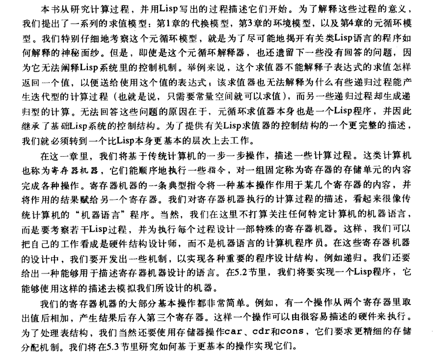
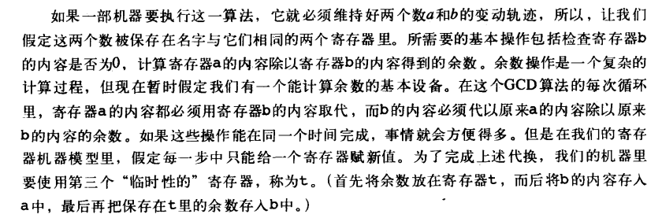
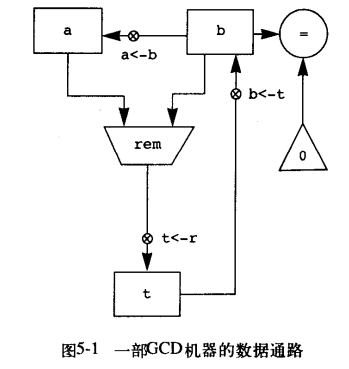

# 5.1 寄存器机器的设计


要设计一个寄存器机器，必须设计好它的数据通路（寄存器和操作）和控制器，该控制器实现操作的顺序执行。

```scheme
(define (gcd a b)
  (if (= b 0)
      a
      (gcd b (remainder a b))))
```



在数据通路图中，

- 寄存器用矩形表示
- 给寄存器赋值的一种方式用一个箭头表示，箭头中含有X，箭头方向表示从数据源指向被赋值的寄存器
- 常数用三角形表示
- 梯形表示计算常数或寄存器的值
- 有箭头无X按钮，从操作的输入寄存器和常量指向操作框，从操作的输出连接到寄存器
- 圆圈表示检测，检测由输入寄存器和常量的减退，没有输出箭头，检测的结果值由控制器使用，并不用与数据通路。

整体上看：数据通路图表示一部机器里所需要的寄存器和操作，以及它们之间的数据连接。



为使数据通路能够实现正确的计算，其中的按钮就必须按照正确的顺序按动。使用一个控制器图描述顺序。

在控制器图中：

- 矩形表示数据通路按钮的按压动作，相当于执行一次寄存器赋值，箭头表示步骤的顺序
- 菱形表示决策，根据菱形中标明的数据通路图所检测的值决定步骤方向


综合在一起，数据通路图和控制器完全描述了一部计算GCD的机器。在寄存器 a b 中存储值后，控制器的启动从标明 start 的位置开始，当控制器达到 done 时，就会看到寄存器 a 里的值。

## 5.1.1 一种描述寄存器机器的语言

数据通路图和控制器图不适合描述大型机器，为能够处理复杂的机器，将创造一种语言，能以正文的形式表现出由数据通路图和控制器图所给出的所有信息。


#### 动作

``read`` 产生一个可以保存到寄存器里的值

``print`` 不产生任何可以存入寄存器的输出值，但是会产生一种效果，但不是所涉及的机器的一部分，这类操作称为动作。

在数据通路图上，动作的表示形式像一个能产生值的操作，用梯形表示，包含动作的名字由来自输入的箭头指向动作框，也为动作关联一个按钮，新增 ``perform`` 指令，是控制器可以按压动作的按钮。

## 5.1.2 机器设计的抽象


将基本的操作用更基本的操作代替抽象

```scheme
(define (remainder n d)
  (if (< n d)
      n
      (remainder (- n d) d)))
```

用 Lisp 汇编形式表示

```scheme
(controller test-b
            (test (op =) (reg b) (const 0))
            (branch (label gcd-done))
            (assign t (reg a))
            rem-loop
            ;; rem 过程
            (test (op <) (reg t) (reg b))
            (branch (label rem-done))
            (assign t (op -) (reg t) (reg b))
            (goto (label rem-loop))
            rem-done
            (assign a (reg b))
            (assign b (reg t))
            (goto (label test-b))
            gcd-done)
```


##### 练习 5.3

```scheme
(define (sqrt x)
	(define (good-enough? guess)
		(< (abs (- (square guess) x)) 0.001))
	(define (improve guess)
		(average guess (/ x guess)))
	(define (sqrt-iter guess)
		(if (good-enough? guess)
		guess
		(sqrt-iter (improve guess))))
	(sqrt-iter 1.0))


(controller
 sqrt-iter
 (test (op good-enough?) (reg guess))
 (branch (label sqrt-done))
 (assign guess (op improve) (reg guess))
 sqrt-done)
```


## 5.1.3 Subroutines

用 ``continue`` 寄存器构造可复用的子程序。 


对于上面两个不同的 ``GCD`` 计算， 可复用为一个 ``GCD `` 子程序，该子程序拥有共用的三个寄存器：``a, b, continue``，当想使用 ``GCD`` 子程序时

```scheme
(assign a (reg x))
(assign b (reg y))
(assign continue (label z)) ;; z 表示后续程序 label 标识，a 寄存器中存储了GCD的结果
```

## 5.1.4 采用堆栈实现递归

```scheme
(define (factorail n)
  (if (= n 1)
      1
      (* (factorail (- n 1)) n)))

;; gcd
(define (gcd a b)
  (if (= b 0)
      a
      (gcd b (remainder a b))))
```

``factorail`` 和 ``gcd`` 不同的地方在与 ``gcd`` 可以用寄存器保存中间结果后继续新的 ``gcd`` 计算（迭代），``factorail`` 需保存在处理完子程序后所需要的状态（N）。

所以需要一个堆栈（后进先出的数据结构）存储完成子程序后所需的状态

新增指令：``restore`` 和 ``save`` 从堆栈中恢复和存储值


```scheme
(controller
 ;; 存储最终结果后续程序
 (assign continue (label fact-done))
 fact-loop
 (test (op =) (reg n) (const 1))
 (branch (label base-case))
 ;; 存储 continue 和 n 到栈中，在处理完成 (factorial (- n 1)) 子程序后，使用
 (save continue)
 (save n)
 ;; n--
 (assign n (op -) (reg n) (const 1))
 ;; 记录后续操作
 (assign continue (label after-fact))
 ;; 进行子程序
 (goto (label fact-loop))
 after-fact
 ;; 完成子程序后从栈中恢复子程序父级状态
 (restore n)
 (restore continue)
 (assign val (op *) (reg n) (reg val))
 ;; 进行后续动作：结束或者是再次结束子程序（本身也为子程序）
 (goto (reg continue))
 base-case
 (assign val (const 1))
 (goto (reg continue))
 fact-done)
```

##### 双重递归

```scheme
(define (fib n)
  (if (< n 2)
      n
      (+ (fib (- n 1)) (fib (- n 2)))))

(controller
 (assign continue (label fib-done))
 fib-loop
 (test (op <) (reg n) (const 2))
 (branch (label immediate-answer))
 ;; 保存完成 fib(n) 后后续操作，并开始 fib(n - 1)
 (save continue)
 (assign continue (label afterfib-n-1))
 (save n)
 (assign n (op -) (reg n) (const 1))
 (goto (label fib-loop))
 afterfib-n-1
 (restore n)
 ;;(restore continue)
 ;; 开始计算 fib(n - 2)
 (assign n (op -) (reg n) (const 2))
 ;;(save continue)
 (assign continue (label afterfib-n-2))
 (save val)
 (goto (label fib-loop))
 afterfib-n-2
 (assign n (reg val))
 (restore val)
 (restore continue)
 (assign val
         (op +) (reg val) (reg n))
 (goto (reg continue))
 immediate-answer
 (assign val (reg n))
 (goto (reg continue))
 fib-done)
```

## 5.1.5 指令总结


