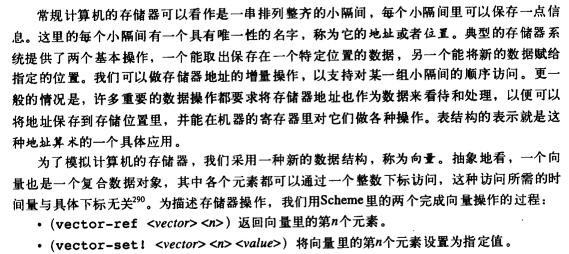
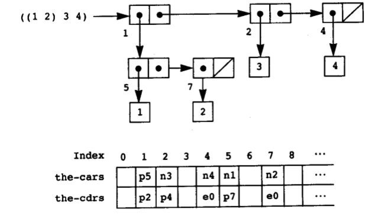
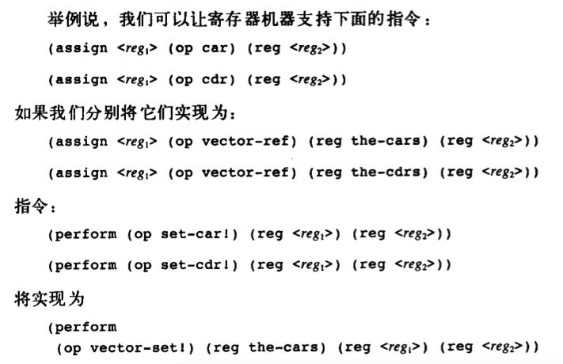
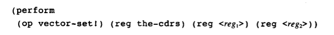
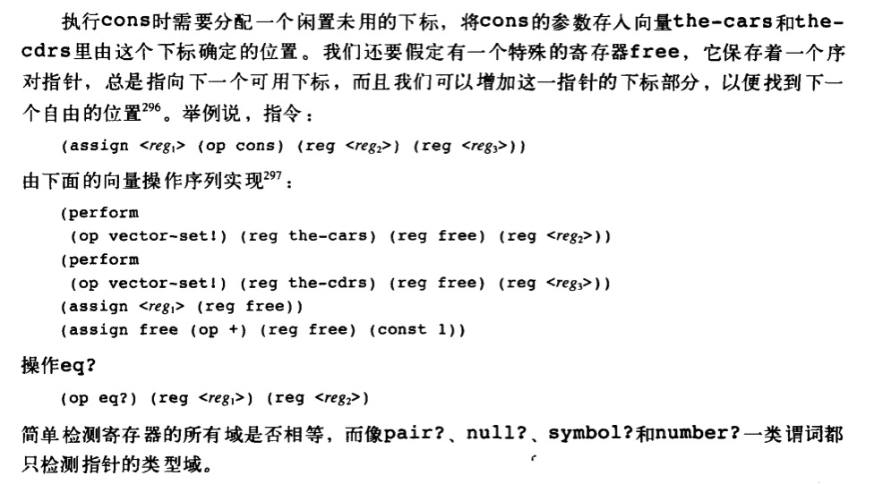

# 5.3存储分配和废料收集

当用 scheme 求值器去实现寄存器机器。通常会将数据部分的表存储结构和基本操作都假设为机器 的基本过程，就可以将精力集中研究scheme解释器里的控制机制。这节内容是讲解计算机中实际的基本数据操作的情况，考察表结构用一种常规的计算机存储器相容的情况。

1. 表示 Lisp 序对的“盒子与指针”结构，其中使用到典型计算机存储器的存储单元和寻址能力。
2. 关系将对存储的管理作为一个计算过程。

Lisp系统的操作强烈依赖于连续创建新数据对象的能力，包括被解释的Lisp过程里显示创建的各种对象，以及有解释器本身创建的对象。若是计算机含有无穷可以快速寻址的存储器，则连续创建新对象不会有问题。实际计算机只包含有限的存储器，所以Lisp系统需要提供一种自动存储分配功能，以支撑无穷存储器的假象。当数据不再需要时，分配的存储就自动回收，并可用于构造新的数据对象，称为废料收集。

## 5.3.1 将存储看做向量

对于向量里元素的访问是基于在存储器里的开始位置的基址+下标，通过快速寻址得到。

#### Lisp 数据的表示

使用向量实现表结构存储器所需的基本序对结构。设想计算机的存储被分成两个向量，the-cars 和 the-cdrs。指向序对的指针就是两个向量的下标，序对的car就是向量the-cars 具有指定下标的项，序对的cdr部分是向量the-cdrs里具有指定下标的项。

并且还需要区分数据的类型（序对，符号，数字），需要采用带类型的指针。指针中包含数据类型的信息。

向量元素中，前缀字母表示数据类型，p代表指向序对指针，n代表常数number，e0代表空表。若是数字指针包含的数值大，则可以构造一个大数类型，指向一个表存储大数的各个信息。符号也可以表示为带类型的指针，指向一个字符序列，Lisp读入程序维护一个符号表（对象表），当读入程序遇到一个符号时，先查找符号表是否存在，再进行构造符号或者返回已存在的符号指针。

#### 基本表操作的实现

利用更基本的存储器操作，实现寄存器机器里的各个“基本”操作。

#### 堆栈的实现

堆栈可以是一个用于保存值得表，有特定的寄存器 the-stack 指向。

单独分配一个向量能提高堆栈的压入和弹出操作性能，并且实现容易，通过增加或减少向量下标的方式实现。