在元循环求值器中，程序用eval和apply过程展示描述了一个scheme解释器的行为，在本节中，需要开发一个显示控制求值器，用以说明求值过程中所用的过程调用的参数传递的基础机制，基于寄存器和堆栈操作描述这种机制。显示控制求值器可以作为scheme解释器的一种实现。

#### 寄存器和操作

设计显示控制求值器时，必须清楚描述用于寄存器机器的各个操作。

scheme求值器机器包含一个堆栈和七个寄存器：

- exp：用于保存被求值的表达式
- env：包含求值的进行所在环境
- val：在求值结束后，包含着通过在指定环境里求值表达式得到的结果
- continue：用于实现递归
- proc，argl、unev：用于求值组合式的时候

## 5.4.1 显示控制求值器的内核

求值器的核心部分为eval-dispatch开始的指令序列，对应于元循环求值器的eval过程。

```scheme
eval-dispatch
     (test (op self-evaluating?) (reg exp))
     (branch (label ev-self-eval))
     (test (op variable?) (reg exp))
     (branch (label ev-variable))
     (test (op quoted?) (reg exp))
     (branch (label ev-quoted))
     (test (op assignment?) (reg exp))
     (branch (label ev-assignment))
     (test (op definition?) (reg exp))
     (branch (label ev-definition))
     (test (op if?) (reg exp))
     (branch (label ev-if))
     (test (op lambda?) (reg exp))
     (branch (label ev-lambda))
     (test (op begin?) (reg exp))
     (branch (label ev-begin))
     (test (op application?) (reg exp))
     (branch (label ev-application))
     (goto (label unknown-expression-type))
```

#### 简单表达式的求值

```scheme
ev-self-eval
     (assign val (reg exp))
     (goto (reg continue))
     ev-variable
     (assign val (op lookup-variable-value) (reg exp) (reg env))
     (goto (reg continue))
     ev-quoted
     (assign val (op text-of-quotation) (reg exp))
     (goto (reg continue))
     ev-lambda
     (assign unev (op lambda-parameters) (reg exp))
     (assign exp (op lambda-body) (reg exp))
     (assign val (op make-procedure)
             (reg unev) (reg exp) (reg env))
     (goto (reg continue))
```

#### 过程应用求值

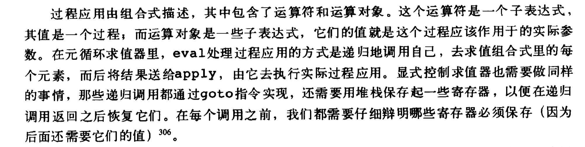

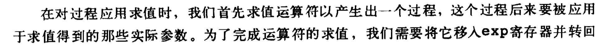

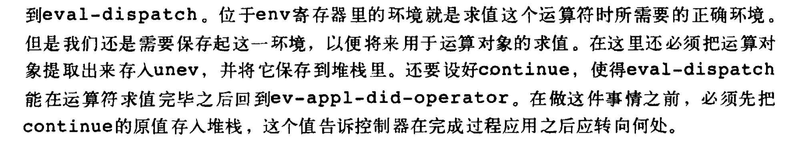

```scheme
ev-application
     (save continue)
     (save env)
     (assign unev (op operands) (reg exp))
     (save unev)
     ;; 先求值运算符
     (assign exp (op operator) (reg exp))
     (assign continue (label ev-appl-did-operator))
     (goto (label eval-dispatch))
```

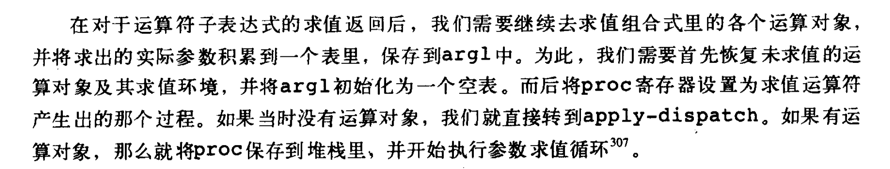

```scheme
;; 求值运算对象初始化
     ev-appl-did-operator
     (restore unev)
     (restore env)
     (assign argl (op empty-arglist))
     ;; 将 proc 设置为求值运算符产生出的过程
     (assign proc (reg val))
     (test (op no-operands?) (reg unev))
     ;; 没参数则直接执行
     (branch (label apply-dispatch))
     (save proc)
```


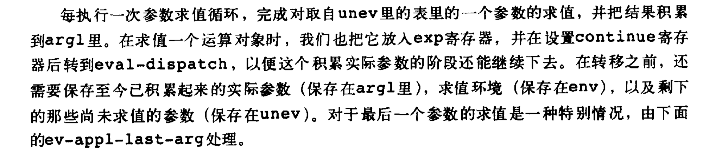

```scheme
;; 取出一个参数进行计算求值
     ev-appl-operand-loop
     (save argl)
     (assign exp (op first-operand) (reg unev))
     (test (op last-operand?) (reg unev))
     (branch (label ev-appl-last-arg))
     (save env)
     (save unev)
     (assign continue (label ev-appl-accumulate-arg))
     (goto (label eval-dispatch))
```

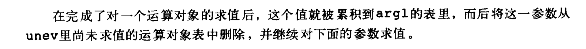

```scheme
;; 求值完一个参数后，积累到 argl 寄存器中，并从 unev 中删除
     ev-appl-accumulate-arg
     (restore unev)
     (restore env)
     (restore argl)
     (assign argl (op adjoin-arg) (reg val) (reg argl))
     (assign unev (op rest-operands) (reg unev))
     (goto (label ev-appl-operand-loop))
```


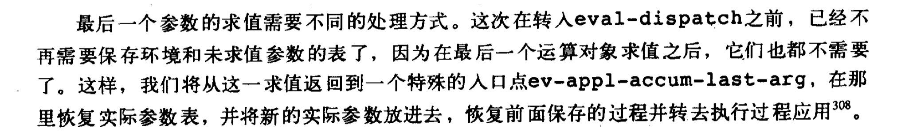

```scheme
ev-appl-last-arg
     (assign continue (label ev-appl-accum-last-arg))
     (goto (label eval-dispatch))
     ev-appl-accum-last-arg
     (restore argl)
     (assign argl (op adjoin-arg) (reg val) (reg argl))
     (restore proc)
     ;; 将参数应用于过程
     (goto (label apply-dispatch))
```

#### 过程应用

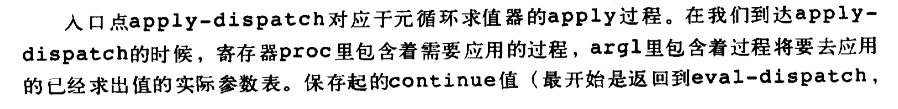

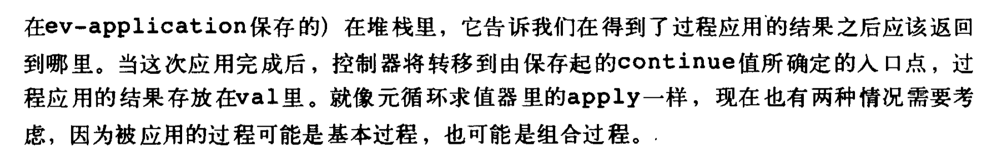

```scheme
;; 过程应用
     apply-dispatch
     (test (op primitive-procedure?) (reg proc))
     (goto (label primitive-apply))
     (test (op compound-procedure?) (reg proc))
     (goto (label compound-apply) (reg proc))
     (goto (label unknown-procedure-type))
     primitive-apply
     (assign val (op apply-primitive-procedure) (reg proc) (reg argl))
     (restore continue)
     (goto (reg continue))
     compound-apply
     (assign unev (op procedure-parameters) (reg proc))
     (assign env (op procedure-environment) (reg proc))
     (assign env (op extend-environment) (reg unev) (reg argl) (reg env))
     (assign unev (op procedure-body) (reg proc))
     (goto (label ev-sequence))
```

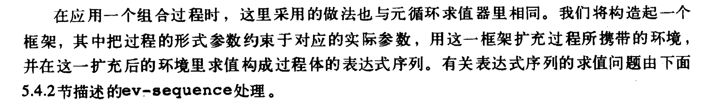

## 序列的求值和尾递归

在处理begin表达式时，最后同样会跳转到ev-sequence。

```scheme
ev-begin
(assign unev (op begin-actions) (reg proc))
(save continue)
(goto (label ev-sequence))
```

序列求值与过程参数求值类似

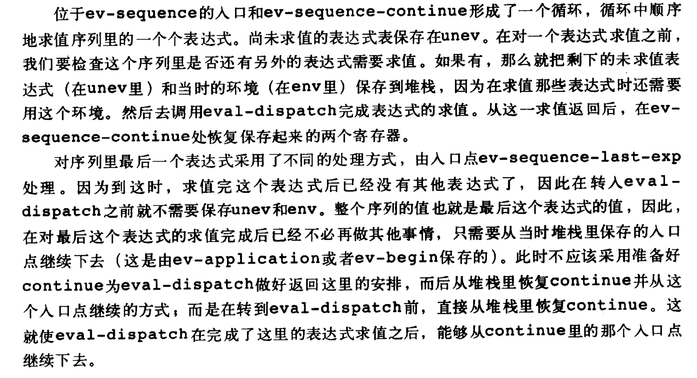

```scheme
ev-sequence
(assign exp (op first-exp) (reg unev))
(test (op last-exp?) (reg unev))
(branch (label ev-sequence-last-exp))
(save unev)
(save env)
(assign continue (label ev-sequence-continue))
(goto (label eval-dispatch))
ev-sequence-continue
(restore env)
(restore unev)
(assign unev (op rest-exps) (reg unev))
(goto (label ev-sequence))
ev-sequence-last-exp
(restore continue)
(goto (label eval-dispatch))
```

#### 尾递归

#### 条件、赋值和定义

```scheme
;; 条件语句
ev-if
(save exp)
(save env)
(save continue)
(assign continue (label ev-if-decide))
(assign exp (op if-predicate) (reg exp))
(goto (label eval-dispatch))
ev-if-decide
(restore continue)
(restore env)
(restore exp)
(test (op true?) (reg val))
(branch (label ev-if-consequent))
ev-if-alternative
(assign exp (op if-alternative) (reg exp))
(goto (label eval-dispatch))
ev-if-consequent
(assign exp (op if-consequent) (reg exp))
(goto (label eval-dispatch))
;; 赋值和定义
ev-assignment
(assign unev (op assignment-variable) (reg exp))
(save unev)
(assign exp (op assignment-value) (reg exp))
(save env)
(save continue)
(assign continue (label ev-assignment-l))
(goto (label eval-dispatch))
ev-assignment-l
(restore continue)
(restore env)
(restore unev)
(perform (op set-variable-value!) (reg unev) (reg val) (reg env))
(assign val (const ok))
(goto (reg continue))
ev-definition
(assign unev (op definition-variable) (reg exp))
(save unev)
(assign exp (op definition-value) (reg exp))
(save env)
(save continue)
(assign continue (label ev-definition-l))
(goto (label eval-dispatch))
ev-definition-l
(restore continue)
(restore env)
(restore unev)
(perform (op define-variable!) (reg unev) (reg val) (reg env))
(assign val (const ok))
(goto (reg continue))
```

## 求值器的运行

初始化 repl

```scala
read-eval-print-loop
(perform (op initialize-stack))
(perform (op prompt-for-input) (const ";;;EC-eval input::"))
(assign exp (op read))
(assign env (op get-glable-environment))
(assign continue (label print-result))
(goto (label eval-dispatch))
print-result
(perform (op announce-output) (const ";;;EC-eval output::"))
(perform (op user-print) (reg val))
(goto (label read-eval-print-loop))
```

错误处理

```scheme
unknown-expression-type
(assign val (const unknown-expression-type-error))
(goto (label signal-error))
unknown-procedure-type
(assign val (const unknown-procedure-type-error))
(goto (label signal-error))
signal-error
(perform (op user-print) (reg val))
(goto (label read-eval-print-loop))
```


